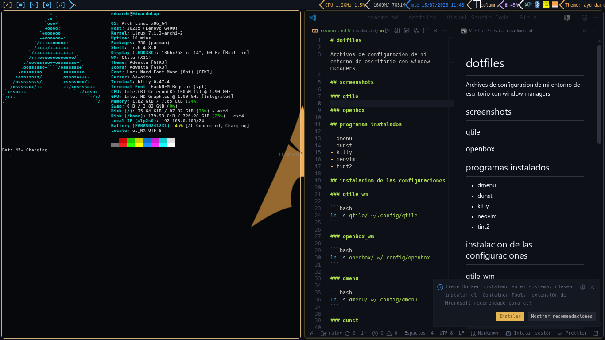
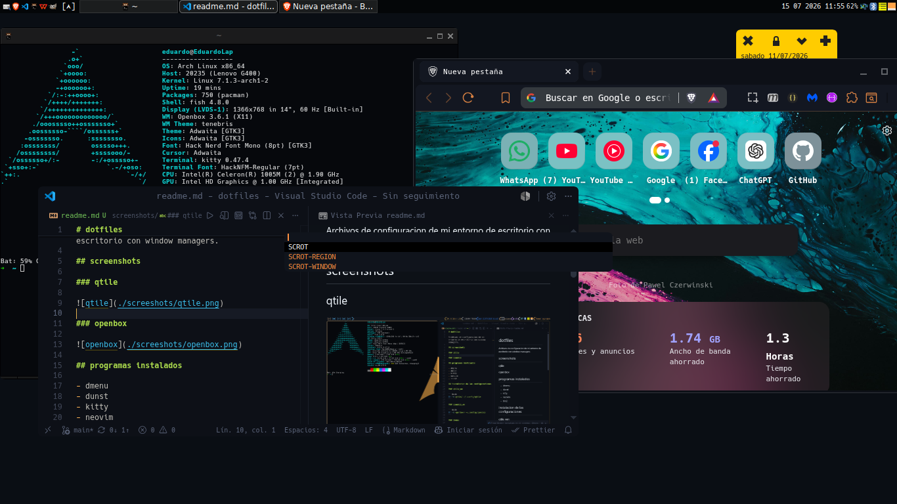

# dotfiles

Archivos de configuracion de mi entorno de escritorio con window managers.

## screenshots

### qtile



### openbox



## programas instalados

- barrier: compartir entradas de mouse y teclado con otras pcs
- bat: cat con enbellesedor
- blueman: manejadir de bluetooth
- brave-bin(aur)
- brightnessctl: control de brillo (laptop)
- dmenu (compilado; center_patch;): menu
- dunst: manejador de notificaciones
- fastfetch: visualizador de caracteristicas del sistema
- feh: visualizador de imagenes, para configurar el fondo de pantalla
- fish: shell amigable con los usuarios
- htop: monitor de recursos del sistema
- indicator-stickynotes: poststicks para esritorio
- kitty: emulador de terminal
- lsd: ls con enbellesedor
- neovim: editor de codigo de terminal
- ntp: sincronizador de hora por red
- openbox: flowting window manager
- pdfarranger: visualizador de pdfs
- picom: compocitor graficos
- playerctl: control de reproducion multimedia
- pulseaudio: controlador de audio
- python-jedi: autocompletado de python para neovim
- python-psutil: utilidades de hardware de python para qtile
- python-pynvim: implementacion de python para neovim deoplete
- qtile: tiling window manager
- ranger: explorador de archvos consola
- scrot: capturador de pantalla (screenshoter)
- thunar: explorador de archvos grafico
- tint2: barra de tareas
- udiskie: manejador de conexiones USBs
- visual-studio-code-bin: editor de codigo grafico
- wps-office-bin: paqueteria office
- xarchiver: visualizador de archivos comprimidos
- zramswap: swap area basada en ram

## clonado de repositorio

```bash
git clone https://github.com/edisc255/dotfiles
```

## instalacion de las configuraciones

### qtile_wm

```bash
ln -s ~/dotfiles/qtile/ ~/.config/
```  

### openbox_wm

```bash
ln -s ~/dotfiles/openbox/ ~/.config/
```

### dmenu

```bash
ln -s ~/dotfiles/dmenu/ ~/.config/
```

### dunst

```bash
ln -s ~/dotfiles/dunst/ ~/.config/
```

### kitty

```bash
ln -s ~/dotfiles/kitty/ ~/.config/
```

### neovim

```bash
ln -s ~/dotfiles/nvim/ ~/.config/
```

### tint2

```bash
ln -s ~/dotfiles/tint2/ ~/.config/
```
